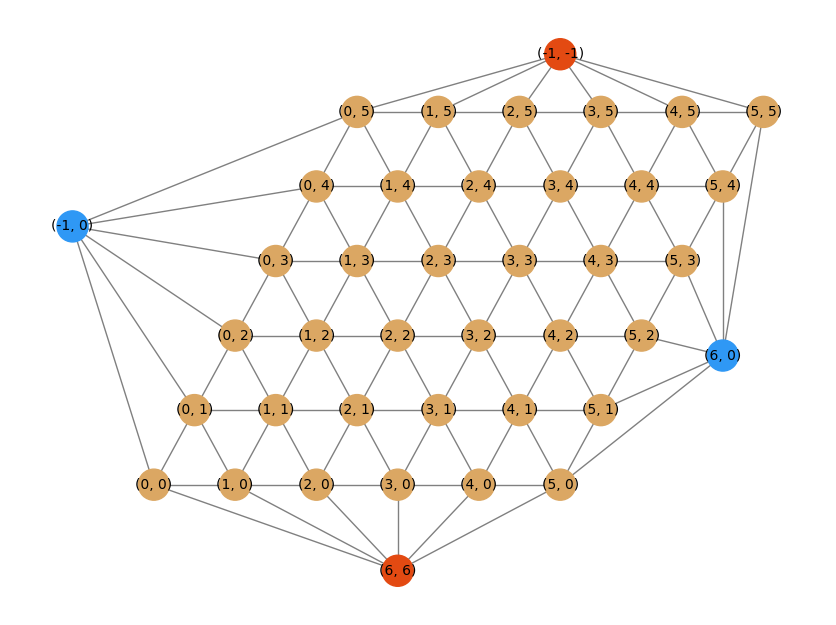

# Systematischer Vergleich von Alpha-Beta-Suche mit einem Neuronalem Netzwerk anhand des Spiels Hex

This repository contains the source code for the Bachelors thesis "Systematischer Vergleich von Alpha-Beta-Suche mit einem Neuronalem Netzwerk anhand des Spiels Hex".

The requirements for this project are: 
```
networkx
matplotlib (for better representation and for statistics)
numpy
tensorflow (only if you want to use the neural network)

```

To play a game of Hex against the computer use 
```
./play.sh [size]
```
Make sure you are in the correct directory!  
This will launch a game with search depth 2 and size [size].  
 
After the execution of the script it should look like this (without matplotlib) 
```
  [0 1 2 3 4 5]
0 [0 0 0 0 0 0]
1 [0 0 0 0 0 0]
2 [0 0 0 0 0 0]
3 [0 0 0 0 0 0]
4 [0 0 0 0 0 0]
5 [0 0 0 0 0 0]
Make move: format"(x,x)"
```
And this with matplotlib:  
  
This was testet on Windows 11 with wsl.

The figures were created with the `graphs.py` file.
You will have to configure it yourself.  

The logic for playing the game is in `hex_grid_networkx.py`.

To run a tournament execute the file `tournament.py` file.

The dataset used for training is in 
 ```
actions/v4-11x11-mohex-mohex-cg2010-vs-mohex-mohex-weak.txt
```
There is a small test file it tests the most basic functions
```
test.py
```
